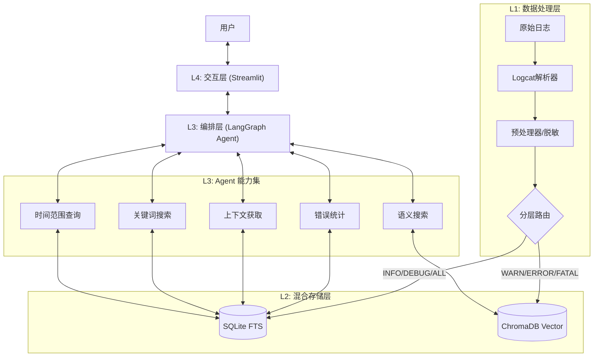

# 🚗 智能座舱日志分析 AI Agent

[](https://www.python.org/)
[](https://streamlit.io/)
[](https://langchain.com/)
[](https://www.trychroma.com/)

这是一个专为**汽车智能座舱**设计的 AI 日志分析系统。它解决了传统车载系统（Android/Linux）日志分析中数据量大、格式晦涩、故障定位依赖人工经验的痛点。

系统采用 **RAG (检索增强生成)** 架构与 **ReAct Agent** 模式，结合了传统关键词搜索的精确性和向量语义搜索的理解能力，能够像资深工程师一样"思考"和排查故障。

---

## ✨ 核心特性

*   **🧠 智能双引擎检索**:
    *   **关键词引擎**: 基于 SQLite FTS5，毫秒级检索 Error Code、PID 或特定 Tag。
    *   **语义引擎**: 基于 ChromaDB 向量数据库，理解 "为什么蓝牙断连" 或 "倒车影像黑屏" 等自然语言意图。
*   **⚡️ 高性能写入**: 采用智能分层索引技术，仅对关键日志（WARN/ERROR/FATAL）进行向量化，写入速度提升 **3.1倍**，支持分钟级处理数万条日志。
*   **🛡️ 企业级健壮性**: 
    *   内置 **PII 脱敏**（自动隐藏手机号、IP、MAC地址）。
    *   **智能去重**，减少 Token 消耗。
    *   **稳健的会话管理**，支持 Streamlit 环境下的多轮对话而不丢失上下文。
*   **🤖 自动化分析工作流**: Agent 能够自主决定查询时间范围、搜索关键词、查看上下文、统计错误分布，直到找到根因。
*   **📊 可视化交互**: 提供直观的 Web 界面，支持文件上传、自动解析、对话式分析和数据可视化。

---

## 🏗 技术架构

系统采用 **分层漏斗 (Layered Funnel)** 架构设计，数据密度自底向上递增：



### 详细设计

#### L1: 数据处理层 (`src/data_layer`)
*   **Parser**: 基于正则表达式的高性能解析器，支持标准 `threadtime` 格式的 Android Logcat。
*   **Preprocessor**: 
    *   **去重**: 移除连续重复的日志（如循环打印的报错），减少干扰。
    *   **PII Masking**: 使用正则自动掩盖敏感信息，保护隐私。

#### L2: 存储与检索层 (`src/storage_layer`)
*   **Keyword Search (SQLite)**: 
    *   存储所有级别的日志。
    *   使用 FTS5 虚拟表实现全文检索。
    *   提供时间范围过滤、Tag 过滤和上下文窗口查询（查找报错前后 N 行）。
*   **Vector Search (ChromaDB)**:
    *   **策略**: 仅存储 WARN、ERROR、FATAL 级别的日志。
    *   **Embedding**: 使用轻量级模型将日志文本转换为向量，支持语义匹配。

#### L3: Agent 编排层 (`src/agent_layer`)
*   **Orchestrator**: 基于 `LangGraph` 构建的 State Graph。
*   **Prompt Engineering**: 内置资深安卓系统专家的 System Prompt，指导 LLM 遵循 "观察-思考-行动" 的排查逻辑。
*   **Tools**: 封装了底层存储能力的 6 个原子工具，Agent 可自主并行调用。

#### L4: 交互层 (`src/interface_layer`)
*   **Session Management**: 实现了复杂的单例模式和工具重绑定机制，确保在 Streamlit 的响应式刷新机制下，Agent 的内存状态和数据库连接不会丢失。

---

## 🚀 快速开始

### 1. 环境准备

*   Python 3.10+
*   OpenAI API Key (支持 GPT-4o/GPT-4-Turbo)

### 2. 安装

推荐使用 `uv` (高性能 Python 包管理器) 进行安装，也可以使用 `pip`。

```bash
# 1. 克隆项目
git clone https://github.com/silenceboychen/log-analysis-agent.git
cd log-analysis-agent

# 2. 创建虚拟环境
# 使用 uv (推荐)
uv venv --python 3.13
source .venv/bin/activate

# 或者使用 venv
python3 -m venv .venv
source .venv/bin/activate

# 3. 安装依赖
uv pip install -r requirements.txt
# 或 pip install -r requirements.txt
```

### 3. 配置

复制环境变量模板并配置 API Key：

```bash
cp .env.example .env
```

编辑 `.env` 文件：
```properties
OPENAI_API_KEY=sk-xxxxxxxxxxxxxxxxxxxxxxxxxxxxxxxx
OPENAI_BASE_URL=https://api.openai.com/v1  # 如果使用中转服务请修改此项
```

### 4. 运行

```bash
streamlit run src/interface_layer/app.py
```

应用将自动在浏览器打开 `http://localhost:8501`。

---

## 📖 使用指南

1.  **上传日志**: 在左侧边栏上传 `.log` 或 `.txt` 文件（支持 Android Logcat）。
2.  **解析加载**: 点击 **"🚀 解析并加载日志"**。系统将显示处理进度、日志统计和级别分布。
3.  **对话分析**: 
    *   **故障定位**: "帮我找找有没有 Crash"
    *   **时间线分析**: "14:28:00 左右发生了什么？"
    *   **模块分析**: "CameraService 有什么异常？"
    *   **根因推断**: "为什么倒车影像黑屏了？"

> **💡 提示**: 如果对话过程中页面刷新，系统会自动恢复会话状态，您无需重新上传日志。

---

## ⚡️ 性能优化

本项目针对大规模日志写入进行了深度优化。

### 优化成果

| 指标 | 优化前 | 优化后 | 提升幅度 |
| :--- | :--- | :--- | :--- |
| **写入速度** | 42 条/秒 | **131 条/秒** | 🚀 **3.1x** |
| **3.8万条日志耗时** | 15 分钟 | **4.9 分钟** | ⚡️ **67% 时间缩减** |

### 优化策略：智能分层索引

我们发现 80% 的日志是 INFO/DEBUG 级别，这些日志通常不需要语义理解，只需精确匹配。因此我们设计了分流策略：

1.  **所有日志** -> 存入 SQLite (极速写入，保证上下文完整)。
2.  **仅高风险日志 (W/E/F)** -> 存入 Vector DB (高成本操作，只关注核心问题)。

---

## 📂 项目结构

```text
log-analysis-agent/
├── config/                 # 配置文件
│   └── config.yaml         # 模型参数、Prompt配置
├── data/                   # 数据存储 (SQLite/ChromaDB/Temp)
├── docs/                   # 设计文档
├── src/                    # 核心源码
│   ├── agent_layer/        # Agent 逻辑
│   │   ├── tools/          # 工具函数定义
│   │   └── orchestrator.py # Agent 编排器
│   ├── data_layer/         # 数据解析清洗
│   │   ├── parsers/        # 各类日志解析器
│   │   └── preprocessor.py # 预处理逻辑
│   ├── interface_layer/    # 前端界面
│   │   └── app.py          # Streamlit 入口
│   └── storage_layer/      # 数据库操作
│       ├── keyword_search.py # SQLite 封装
│       └── vector_search.py  # ChromaDB 封装
├── tests/                  # 测试脚本
├── .env.example            # 环境变量模板
├── README.md               # 项目文档
└── requirements.txt        # 依赖列表
```

---

## 🗺 路线图 & 状态

### ✅ 已完成 (Phase 1-5)
*   [x] 基础架构搭建与环境配置
*   [x] Android Logcat 解析器与预处理器
*   [x] SQLite FTS 关键词检索引擎
*   [x] ChromaDB 向量检索引擎
*   [x] Agent 工具集 (时间/关键词/语义/上下文)
*   [x] LangGraph Agent 编排逻辑
*   [x] Streamlit 交互界面开发
*   [x] **性能优化**: 向量库写入速度提升 3x
*   [x] **关键修复**: Streamlit 会话状态持久化与工具热重载

### 📅 规划中 (Future)
*   [ ] 支持 Kernel Log (dmesg) 解析
*   [ ] 引入 Log Pattern Mining (Drain 算法) 自动聚类模式
*   [ ] 支持本地 LLM (Qwen-2.5-Coder, DeepSeek)
*   [ ] 生成 HTML 格式的专业分析报告

---

## 🤝 贡献

欢迎提交 Issue 和 Pull Request！

## 📄 许可证

MIT License
