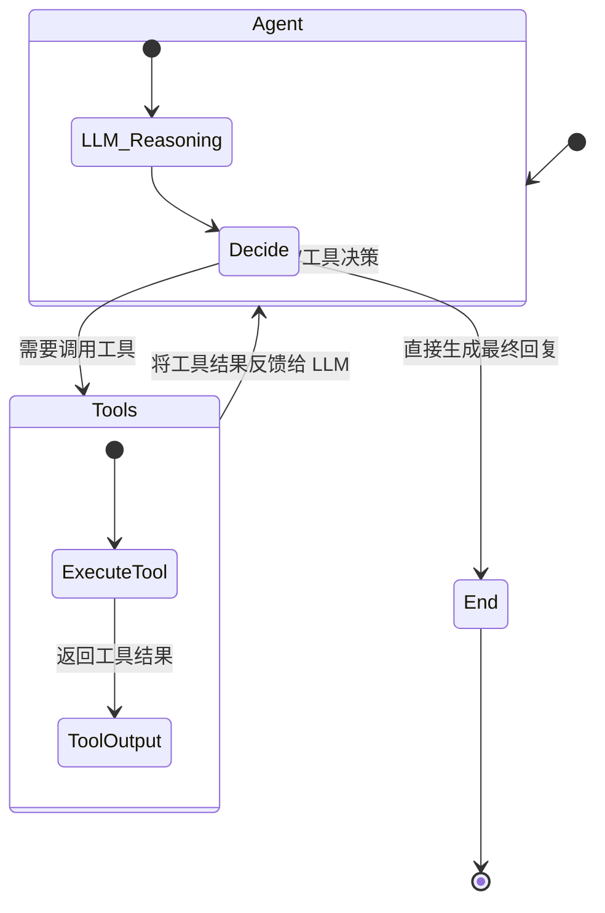
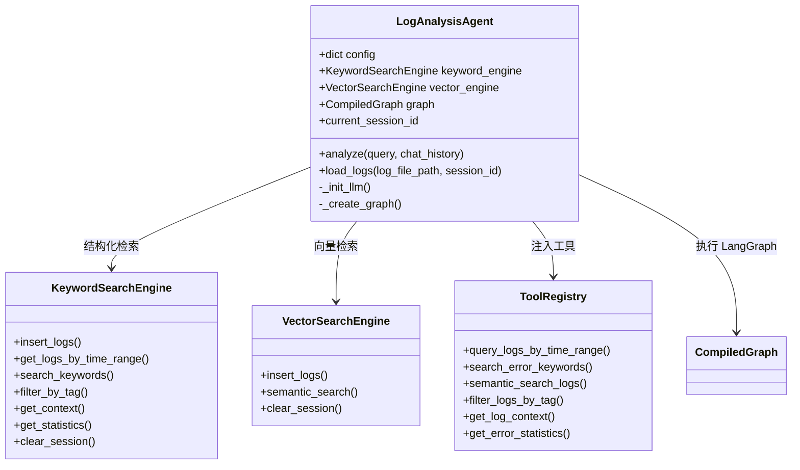

# LangGraph 架构说明与迁移指南

面向本项目的 LangGraph 版本 Agent 说明，聚焦 `src/agent_layer/graph_orchestrator.py` 的实现、工作流和迁移要点，修复了原文档的目录混乱与图表渲染问题。

## 1. 背景与目标

- 现有 AgentExecutor 方案在多轮对话、可控性和调试可视化上存在局限。
- LangGraph 提供有状态图（StateGraph）、Checkpointer、可中断/回溯的执行流，更适合日志分析这类需要迭代推理的场景。
- 本文档帮助理解现有实现并指导从旧 orchestrator 迁移到 LangGraph 版本。

## 2. 与 AgentExecutor 的差异

| 维度         | AgentExecutor           | LangGraph ReAct 预构建                                  |
| ------------ | ----------------------- | ------------------------------------------------------- |
| 状态管理     | 手工维护 `chat_history` | 内置 Checkpointer（MemorySaver），按 `thread_id` 持久化 |
| 可控性       | 黑盒循环，干预困难      | 显式图结构，可暂停、修改状态、强制跳转                  |
| 调试与可视化 | 主要靠日志              | 图节点/边可视化，易于排查                               |
| 中间过程     | 不透明                  | 每轮消息均存入 `messages`，便于审计                     |

## 3. 核心代码入口

- `src/agent_layer/graph_orchestrator.py`：LogAnalysisAgent 的 LangGraph 编排，创建 LLM、注入工具、设置 Checkpointer，负责 `analyze` 调用。
- `src/agent_layer/tools/log_tools.py`：面向 LLM 的工具集（日志检索、上下文获取、统计等），由 LangGraph 的 Tool 节点调用。
- 数据存储：`KeywordSearchEngine`（关键字/结构化检索）、`VectorSearchEngine`（语义检索），分别在 `load_logs` 时写入。

运行：

```bash
 python -m src.agent_layer.graph_orchestrator
```

## 4. LangGraph 工作流（ReAct）



执行要点：

1. 接收用户 Query，组装为 `HumanMessage`；
2. `create_react_agent` 产生的图决定是回答还是进入 Tool 节点；
3. Tool 结果写回 `messages`，循环直到满足终止条件；
4. 最终回答取自 `messages` 的最后一条 `AIMessage`。

## 5. 类关系



## 6. 关键实现（基于 src/agent_layer/graph_orchestrator.py）

- LLM 初始化：`_init_llm()` 读取 `.env` 的 `OPENAI_API_KEY/OPENAI_BASE_URL/OPENAI_MODEL`，默认模型 `gpt-4o`。
- Graph 构建：`_create_graph()` 中创建 `MemorySaver`，调用 `create_react_agent(model=self.llm, tools=ALL_TOOLS, checkpointer=checkpointer, prompt=system_prompt)`。
- 调用入口：`analyze()` 以 `thread_id = current_session_id or "default"` 传入 `config={"configurable": {"thread_id": thread_id}}`，LangGraph 自动续接历史。
- 结果解析：`graph.invoke` 返回包含 `messages` 的最终状态，最后一条 `AIMessage` 即最终回答。
- 日志加载：`load_logs()` 解析文件 -> 预处理 -> 关键字索引全部日志 -> 向量库只索引 W/E/F 级别，用于语义检索。

## 7. 工具集（src/agent_layer/tools/log_tools.py）

- `query_logs_by_time_range(start_time, end_time, level=None)`：按时间段过滤日志并给出级别分布。
- `search_error_keywords(keywords, level=None, tag=None)`：基于关键词的错误检索，返回 Tag 统计与示例。
- `semantic_search_logs(query, n_results=10)`：向量语义检索，按相似度排序。
- `filter_logs_by_tag(tag, limit=20)`：按模块 Tag 过滤。
- `get_log_context(log_id, window_size=20)`：获取某条日志的前后文。
- `get_error_statistics(session_id=None)`：返回总量、级别分布、Top Tags、时间范围。

## 8. 迁移指引（从 orchestrator.py 到 graph_orchestrator.py）

1. 依赖：确保已安装 `langgraph`（已写入 `requirements.txt`）。
2. 初始化：移除 `AgentExecutor`，改为 `MemorySaver` + `create_react_agent`。
3. 调用：使用 `config={"configurable": {"thread_id": "<session>"}}`，无需手工拼接历史。
4. 结果：从 `final_state["messages"][-1].content` 读取最终答案。
5. 会话：`current_session_id` 绑定存储与检索，保持一条日志会话的上下文。
6. 可观测性：LangGraph 支持对图节点的可视化和中断，方便调试工具调用链。
