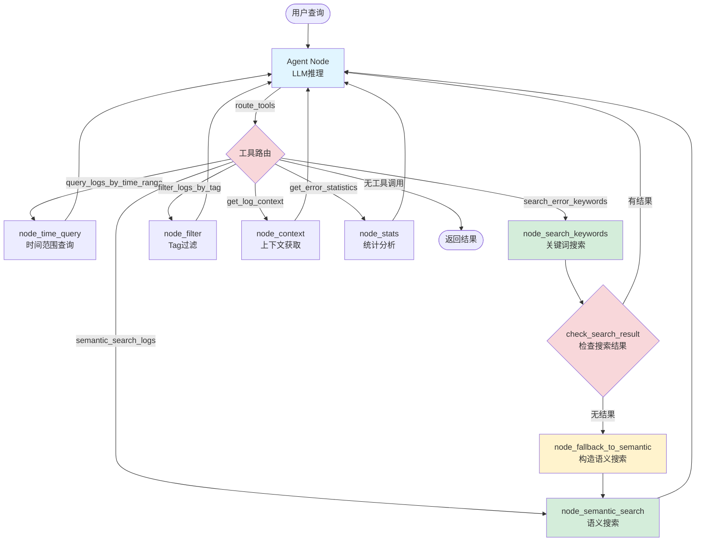
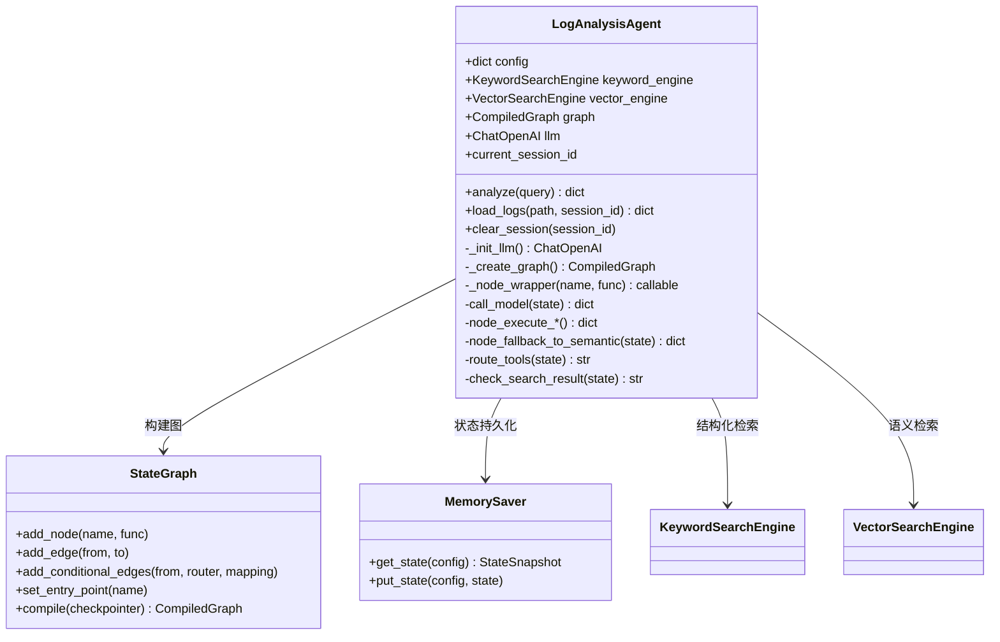

# LangGraph 架构说明 - 完整实现指南

面向本项目的 LangGraph 版本 Agent 说明，详细介绍 `src/agent_layer/graph_orchestrator.py` 的显式 StateGraph 实现、Node Wrapper 机制、智能 Fallback 路由，以及完整的架构设计。

## 1. 背景与目标

- ✅ **从 `create_react_agent` 迁移到显式 `StateGraph`**：更强的可控性和可观测性
- ✅ **独立工具节点**：每个工具都是独立的 Node，便于监控和调试
- ✅ **Node Wrapper 机制**：统一的日志记录和钩子函数，支持性能监控
- ✅ **智能 Fallback**：关键词搜索失败自动切换到语义搜索
- ✅ **递归控制**：合理的 recursion_limit 配置，避免无限循环

## 2. 核心架构差异

| 维度 | AgentExecutor | create_react_agent | 显式 StateGraph (当前实现) |
|------|--------------|---------------------|--------------------------|
| 状态管理 | 手工维护 | MemorySaver | MemorySaver + 显式状态 |
| 可控性 | ❌ 黑盒 | ⚠️ 部分透明 | ✅ 完全透明，可自定义路由 |
| 调试 | ❌ 仅日志 | ⚠️ 基础可视化 | ✅ 节点级日志 + Wrapper |
| 扩展性 | ❌ 困难 | ⚠️ 受限 | ✅ 易扩展（自定义节点/边） |
| Fallback | ❌ 不支持 | ❌ 不支持 | ✅ 智能Fallback机制 |
| 性能监控 | ❌ 无 | ❌ 无 | ✅ Node Wrapper支持 |

## 3. 完整执行流程图



## 4. Node Wrapper 机制

所有节点都通过 `_node_wrapper` 包装，提供统一的日志和钩子：

```python
def _node_wrapper(self, node_name: str, func):
    """Wrapper to add hooks around node execution."""
    @functools.wraps(func)
    def wrapper(state: AgentState):
        # Pre-execution hooks
        logger.info(f"======================== Entering node: {node_name} ========================")
        
        # Execute
        result = func(state)
        
        # Post-execution hooks
        logger.info(f"======================== FINISHED NODE: {node_name} ========================")
        
        return result
    return wrapper
```

**日志输出示例**：
```
20:38:13 | INFO | ======================== Entering node: node_search_keywords ========================
DEBUG: Keyword search 'crash exception' returned 0 results
20:38:13 | INFO | ======================== FINISHED NODE: node_search_keywords ========================
20:38:13 | INFO | ======================== Entering node: node_fallback_to_semantic ========================
Using fallback: Keyword search failed, trying semantic search...
20:38:13 | INFO | ======================== FINISHED NODE: node_fallback_to_semantic ========================
```

## 5. 节点架构设计

### 5.1 节点列表

| 节点名称 | 类型 | 功能 | Wrapper |
|---------|------|------|---------|
| **agent** | LLM | 主推理节点，决定调用哪个工具 | ✅ |
| **node_time_query** | 工具 | 时间范围查询 | ✅ |
| **node_search_keywords** | 工具 | 关键词搜索（支持Fallback） | ✅ |
| **node_semantic_search** | 工具 | 语义搜索 | ✅ |
| **node_filter** | 工具 | Tag过滤 | ✅ |
| **node_context** | 工具 | 上下文获取 | ✅ |
| **node_stats** | 工具 | 统计分析 | ✅ |
| **node_fallback_to_semantic** | 自定义 | Fallback逻辑节点 | ✅ |

### 5.2 工具节点实现

为支持 Node Wrapper，所有工具节点都采用自定义函数包装 ToolNode：

```python
def node_execute_keyword_search(self, state: AgentState):
    """执行关键词搜索工具"""
    from langgraph.prebuilt import ToolNode
    tool_node = ToolNode([search_error_keywords])
    return tool_node.invoke(state)
```

然后应用wrapper：
```python
workflow.add_node("node_search_keywords", 
    self._node_wrapper("node_search_keywords", self.node_execute_keyword_search))
```

## 6. 智能 Fallback 机制

### 6.1 设计思路

当关键词搜索返回空结果时，自动切换到语义搜索：

```python
def check_search_result(self, state: AgentState) -> str:
    """检查搜索结果，决定是否Fallback"""
    messages = state['messages']
    last_message = messages[-1]  # ToolMessage
    
    # 检查是否找到结果
    if "没有找到" in last_message.content or "found 0" in last_message.content.lower():
        return "fallback"
    return "agent"
```

### 6.2 Fallback节点

```python
def node_fallback_to_semantic(self, state: AgentState):
    """将失败的关键词搜索转换为语义搜索"""
    messages = state['messages']
    last_ai_message = messages[-2]  # 获取原始工具调用
    
    # 提取原始关键词
    tool_call = last_ai_message.tool_calls[0]
    keywords = tool_call['args'].get('keywords')
    
    # 构造语义搜索调用
    new_tool_call = {
        'name': 'semantic_search_logs',
        'args': {'query': keywords},
        'id': str(uuid.uuid4()),
        'type': 'tool_call'
    }
    
    return {"messages": [AIMessage(
        content=f"关键词 '{keywords}' 未搜索到结果，尝试使用语义搜索...",
        tool_calls=[new_tool_call]
    )]}
```

## 7. 路由逻辑

### 7.1 工具路由

```python
def route_tools(self, state: AgentState) -> str:
    """决定下一步调用哪个工具节点"""
    messages = state['messages']
    last_message = messages[-1]
    
    if not hasattr(last_message, "tool_calls") or not last_message.tool_calls:
        return "end"
    
    tool_name = last_message.tool_calls[0]['name']
    
    tool_node_map = {
        "query_logs_by_time_range": "node_time_query",
        "search_error_keywords": "node_search_keywords",
        "semantic_search_logs": "node_semantic_search",
        "filter_logs_by_tag": "node_filter",
        "get_log_context": "node_context",
        "get_error_statistics": "node_stats"
    }
    
    return tool_node_map.get(tool_name, "end")
```

### 7.2 图连接

```python
workflow = StateGraph(AgentState)

# 添加节点
workflow.add_node("agent", self._node_wrapper("agent", self.call_model))
workflow.add_node("node_search_keywords", 
    self._node_wrapper("node_search_keywords", self.node_execute_keyword_search))
# ... 其他节点

# 设置路由
workflow.add_conditional_edges("agent", self.route_tools, {
    "node_time_query": "node_time_query",
    "node_search_keywords": "node_search_keywords",
    # ...
    "end": END
})

# Fallback路由
workflow.add_conditional_edges("node_search_keywords", self.check_search_result, {
    "agent": "agent",
    "fallback": "node_fallback_to_semantic"
})
workflow.add_edge("node_fallback_to_semantic", "node_semantic_search")
```

## 8. 配置优化

### 8.1 Recursion Limit

```python
config = {
    "configurable": {"thread_id": thread_id},
    "recursion_limit": 50  # 增加递归限制处理复杂查询
}
```

### 8.2 SystemMessage 处理

```python
current_state = self.graph.get_state(config)

input_messages = []
# 只在新会话时添加 SystemMessage
if not current_state.values or len(current_state.values.get('messages', [])) == 0:
    input_messages.append(SystemMessage(content=system_prompt_content))

input_messages.append(HumanMessage(content=query))
```

### 8.3 Loguru 配置

```python
# 移除所有默认 handler
logger.remove()
# 添加简单handler避免拦截
logger.add(lambda msg: print(msg, end=""), format="{time:HH:mm:ss} | {level} | {message}")
```

## 9. 工具集详解

详见 `src/agent_layer/tools/log_tools.py`：

| 工具 | 参数 | 功能 | 注意事项 |
|------|------|------|----------|
| `query_logs_by_time_range` | start_time, end_time, level | 时间范围查询 | ISO格式时间 |
| `search_error_keywords` | keywords, level, tag | 关键词搜索 | 支持OR逻辑 |
| `semantic_search_logs` | query, n_results | 语义搜索 | 基于向量相似度 |
| `filter_logs_by_tag` | tag, limit | Tag过滤 | 支持模糊匹配 |
| `get_log_context` | log_id, window_size | 上下文获取 | 前后N行 |
| `get_error_statistics` | session_id | 统计分析 | 级别分布等 |

## 10. 类关系图



## 11. 运行与测试

### 11.1 环境准备

```bash
# 安装依赖
pip install -r requirements.txt

# 配置环境变量
OPENAI_API_KEY=your_key
OPENAI_BASE_URL=https://api.openai.com/v1
OPENAI_MODEL=gpt-4o
```

### 11.2 运行测试

```bash
# 激活虚拟环境（Windows）
.\.venv\Scripts\Activate.ps1

# 运行测试
python -m src.agent_layer.graph_orchestrator
```

### 11.3 验证 Wrapper

查看日志输出中的节点进入/退出标记：
```
======================== Entering node: agent ========================
======================== FINISHED NODE: agent ========================
```

### 11.4 验证 Fallback

测试不存在的关键词：
```python
result = agent.analyze("查找 'nonexistent_keyword_123' 的日志")
```

应看到：
```
Entering node: node_search_keywords
没有找到包含 'nonexistent_keyword_123' 的日志
FINISHED NODE: node_search_keywords
Entering node: node_fallback_to_semantic
关键词 'nonexistent_keyword_123' 未搜索到结果，尝试使用语义搜索...
FINISHED NODE: node_fallback_to_semantic
Entering node: node_semantic_search
```

## 12. 性能优化建议

1. **Wrapper 扩展**：添加执行时间统计
   ```python
   start_time = time.time()
   result = func(state)
   duration = time.time() - start_time
   logger.info(f"Node {node_name} executed in {duration:.2f}s")
   ```

2. **并行工具调用**：对独立工具实现并行执行
3. **缓存机制**：缓存常见查询结果
4. **动态 Recursion Limit**：根据查询复杂度动态调整

## 13. 故障排查

### 13.1 Recursion Limit错误

**症状**：`Recursion limit of 25 reached`

**解决**：增加 `recursion_limit` 配置到 50 或更高

### 13.2 Tool Calls 格式错误

**症状**：`An assistant message with "tool_calls" must be followed by tool messages`

**解决**：清除旧会话状态，避免消息堆积
```python
agent.clear_session("your_session_id")
```

### 13.3 Loguru KeyError

**症状**：`KeyError: "'error'"`

**解决**：已修复，确保使用 `logger.remove()` + 自定义handler

## 14. 下一步开发

- [ ] 实现多模态 Fallback（keyword → semantic → hybrid）
- [ ] 添加性能监控仪表板
- [ ] 实现工具调用的重试机制
- [ ] 支持并行工具调用
- [ ] 添加会话摘要功能
- [ ] 实现更持久的 Checkpointer（Redis/PostgreSQL）

## 15. 参考资源

- [LangGraph 官方文档](https://python.langchain.com/docs/langgraph)
- [StateGraph API](https://python.langchain.com/docs/langgraph/reference/graphs)
- [项目验证报告](../walkthrough.md)
