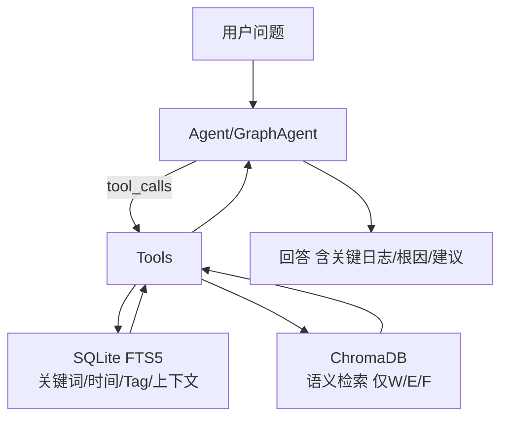
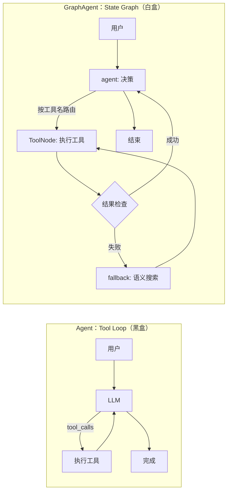
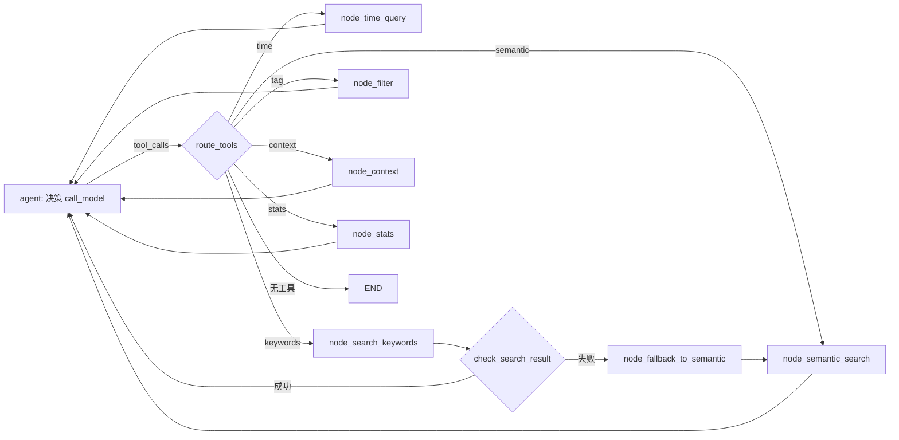

# 使用 LangGraph 从零构建日志分析智能体：实现智能日志检索与分析实战（v3）

目标：让用户“说人话”分析车载/Android/Linux 日志，同时在工程侧做到**检索可控、流程可控、会话隔离、可观测、可扩展**，并兼顾**性能与隐私**。

核心代码（建议边读边对照）：

- `src/agent_layer/orchestrator.py`：`LogAnalysisAgent`（Agent / Tool Loop，一键黑盒）
- `src/agent_layer/graph_orchestrator.py`：`LogAnalysisAgent`（GraphAgent / State Graph，手写白盒）
- `src/agent_layer/tools/log_tools.py`：6 个 Tools + `init_tools()` 注入
- `src/storage_layer/keyword_search.py`：SQLite + FTS5（全量关键词检索）
- `src/storage_layer/vector_search.py`：ChromaDB（语义检索，只索引 W/E/F）
- `src/data_layer/parsers/logcat_parser.py`：Logcat 解析（`LogEntry`）
- `src/data_layer/preprocessor.py`：预处理（过滤/去重/PII 脱敏/标注）
- `src/interface_layer/app.py`：Streamlit UI（上传、会话、单例、重绑工具）

---

## 第零章. 快速开始（5 分钟跑通）

### 0.1 安装依赖

| 目标         | 命令                              |
| ------------ | --------------------------------- |
| 安装项目依赖 | `pip install -r requirements.txt` |

如果你用 `uv`：

- `uv pip install -r requirements.txt`

> 运行环境：Python 3.10+（仓库徽标与 README 约定）。

### 0.2 配置环境变量（OpenAI 兼容接口）

示例会读取项目根目录 `.env` 或环境变量（仓库自带 `.env.example`）。

```dotenv
OPENAI_API_KEY=sk-xxxxxx
OPENAI_MODEL=gpt-4o
OPENAI_BASE_URL=https://api.openai.com/v1
```

### 0.3 运行两套模式

| 模式                      | 入口      | 命令                                           | 说明                                |
| ------------------------- | --------- | ---------------------------------------------- | ----------------------------------- |
| Agent（Tool Loop）        | CLI 测试  | `python -m src.agent_layer.orchestrator`       | 偏 Demo：快，但黑盒                 |
| GraphAgent（State Graph） | CLI 测试  | `python -m src.agent_layer.graph_orchestrator` | 默认推荐：可控、可观测、带 Fallback |
| Web UI（默认 GraphAgent） | Streamlit | `streamlit run src/interface_layer/app.py`     | 上传日志 + 对话分析                 |

切换 UI 使用哪套 Agent：改 `src/interface_layer/app.py` 的导入即可：

```python
# Agent（Tool Loop）
# from src.agent_layer.orchestrator import LogAnalysisAgent

# GraphAgent（State Graph，默认）
from src.agent_layer.graph_orchestrator import LogAnalysisAgent
```

### 0.4 简单验证（推荐用仓库自带样例日志）

样例日志位置：`tests/sample_logs/android_logcat_sample.log`

- CLI：跑 GraphAgent（需要配置 `OPENAI_API_KEY`）
  - `python -m src.agent_layer.graph_orchestrator`
- UI：启动 Streamlit 后，上传样例日志，点击“🚀 解析并加载日志”，然后提问：
  - “帮我查找所有崩溃相关的日志”
  - “分析一下 14:28:45 到 14:28:50 之间发生了什么”

---

## 第一章. 概述与核心概念

### 1.1 日志分析为什么不能“直接把整包日志塞给模型”

**痛点：**

- **上下文放不下**：日志动辄几十万行，模型上下文不可能全装。
- **成本与延迟不可控**：全量喂给模型，慢且贵。
- **缺少可复现性**：你很难回答“它为什么这么说”，也很难做审计与回放。

**解决方案：** 把“看日志”拆成可控的确定性流程：解析 → 预处理 → 索引 → 工具检索 → 智能体推理。



### 1.2 关键抽象速览（看懂这些就能读代码）

| 概念                      | 负责什么                                    | 对应位置                                  |
| ------------------------- | ------------------------------------------- | ----------------------------------------- |
| `LogEntry`                | 标准化日志结构（时间、级别、Tag、message…） | `src/data_layer/parsers/logcat_parser.py` |
| `LogcatParser`            | 解析 Logcat 文本为 `LogEntry` 列表          | `src/data_layer/parsers/logcat_parser.py` |
| `LogPreprocessor`         | 过滤/去重/PII 脱敏/简单标注                 | `src/data_layer/preprocessor.py`          |
| `KeywordSearchEngine`     | SQLite+FTS5：全量入库与关键词检索           | `src/storage_layer/keyword_search.py`     |
| `VectorSearchEngine`      | ChromaDB：语义检索（只索引 W/E/F）          | `src/storage_layer/vector_search.py`      |
| `session_id`              | 日志文件会话隔离（数据过滤 + 线程记忆）     | `src/interface_layer/app.py` + 两版 Agent |
| `init_tools()`            | 把引擎/agent 注入工具模块（全局依赖）       | `src/agent_layer/tools/log_tools.py`      |
| 6 个 Tools                | 时间/关键词/语义/Tag/上下文/统计            | `src/agent_layer/tools/log_tools.py`      |
| Agent（Tool Loop）        | 一键 Agent：黑盒工具循环                    | `src/agent_layer/orchestrator.py`         |
| GraphAgent（State Graph） | 手写图：显式路由 + Fallback + 可观测        | `src/agent_layer/graph_orchestrator.py`   |
| `AgentState`              | Graph 状态（当前仅含 `messages`）           | `src/agent_layer/graph_orchestrator.py`   |
| `MemorySaver`             | 内存级 checkpoint（会话内记忆）             | `src/agent_layer/graph_orchestrator.py`   |
| UI 会话                   | `agent_instance` 单例 + `messages` 渲染     | `src/interface_layer/app.py`              |

### 1.3 为什么有两种 Agent：Tool Loop vs 状态图

**痛点：** 日志排障常常不是一步到位：先圈时间 → 再筛模块 → 再查关键词 → 再看上下文 → 失败要回退（Fallback）→ 最后总结。

**解决方案：** 同一套检索能力，两种编排方式：

- **Agent（Tool Loop）**：把“工具调用”交给模型自由发挥，开发快，但流程不可控。
- **GraphAgent（State Graph）**：把阶段拆成节点，并用路由强约束流程，适合生产级排障。



---

## 第二章. 整体架构（从“能跑”到“可上线”）

### 2.1 分层架构：谁负责什么

- **数据层** `src/data_layer`：解析/清洗/脱敏/去重
- **存储层** `src/storage_layer`：SQLite（全量）+ ChromaDB（关键日志）
- **工具层** `src/agent_layer/tools`：把检索能力封装成可调用的原子工具
- **编排层** `src/agent_layer`：两套 Agent（黑盒/白盒）
- **交互层** `src/interface_layer`：Streamlit UI（上传、会话、渲染）

### 2.2 一次请求的端到端链路（谁先做什么）

端到端分两段：**加载日志**（建索引）+ **对话分析**（检索与推理）。

**A. 加载日志（一次/每个文件）**

1.  UI 上传文件 → 写入 `data/temp/`（`src/interface_layer/app.py`）
2.  `agent.load_logs(path, session_id=...)`
3.  `LogcatParser.parse_file()` 解析为 `LogEntry` 列表
4.  `LogPreprocessor.process()`：过滤/去重/脱敏/标注
5.  SQLite 全量入库（`KeywordSearchEngine.insert_logs()`）
6.  仅 W/E/F 入向量库（`VectorSearchEngine.insert_logs()`）
7.  `agent.current_session_id = session_id`（后续检索都用它过滤）

**B. 对话分析（每次提问）**

1.  用户输入问题
2.  Agent/GraphAgent 调用 LLM（带 System Prompt）
3.  LLM 决策是否调用工具（Tool Calls）
4.  Tools 读取 `current_session_id` → 查询 SQLite/Chroma → 返回摘要
5.  LLM 汇总：给出故障时间点、关键日志、根因分析、建议方案

### 2.3 可扩展点（插拔式能力）

如果你要把它从 Demo 变成“可长期演进的系统”，优先改这些点：

- **新增日志格式**：在 `src/data_layer/parsers/` 增加 parser，并在 `load_logs()` 选择对应 parser
- **新增工具**：在 `src/agent_layer/tools/log_tools.py` 增加 `@tool`，并更新：
  - `ALL_TOOLS`
  - GraphAgent：新增 `ToolNode` + 更新 `route_tools()` 的映射
- **替换/增强向量化策略**：调整 `VectorSearchEngine` 的 embedding/分流策略（例如加入 ERROR 堆栈聚合）
- **持久化会话记忆**：把 `MemorySaver()` 替换为“持久化 checkpointer”（需按 LangGraph 版本选型/实现）
- **服务化输出**：在 Streamlit 之外增加 API 层（SSE/WebSocket）或报告导出（HTML/PDF）

---

## 第三章. 核心模块设计（解析、检索、工具、会话、UI）

### 3.1 LogcatParser：结构化的第一步

**支持的日志格式：**

- 标准 Logcat：`MM-DD HH:MM:SS.mmm  PID  TID Level Tag: Message`

**关键实现点：**

- 用正则抽取 month/day/time/pid/tid/level/tag/message
- Logcat 不含年份：当前 parser 默认 `current_year=2025`（见常见坑）
- 输出统一为 `LogEntry`，后续存储/检索都基于它

位置：`src/data_layer/parsers/logcat_parser.py`

### 3.2 LogPreprocessor：降噪 + 脱敏 + 简单标注

**它做什么：**

- **级别过滤**：低于 `min_log_level` 的丢弃（当前 `load_logs()` 固定为 `I`）
- **Tag 降噪**：过滤 `chatty/Perflock/QC-QMI` 等噪音 Tag
- **去重**：连续重复（同 tag + message 前 100 字符）超过 3 次时压缩
- **PII 脱敏**：手机号/邮箱/IP/坐标替换成占位符
- **标注**：粗粒度标注 `[CRASH]/[ANR]/[MEMORY]`（便于后续检索）

位置：`src/data_layer/preprocessor.py`

### 3.3 KeywordSearchEngine：SQLite + FTS5（全量、精确、快）

**核心设计：**

- 主表 `logs` 存全量日志（含 `session_id`）
- 虚拟表 `logs_fts` 做全文索引（tag/message）
- 用触发器保持主表与 FTS 同步
- 给 `datetime/level/tag/session_id` 建索引，配合过滤条件加速

你能用它做什么（对应工具）：

- 时间范围：`get_logs_by_time_range()`
- 关键词：`search_keywords()`
- Tag 过滤：`filter_by_tag()`
- 上下文：`get_context()`（基于 `line_number` 回溯前后 N 行）
- 统计：`get_statistics()`

位置：`src/storage_layer/keyword_search.py`

### 3.4 VectorSearchEngine：ChromaDB（少而精的语义补充）

**为什么只索引 W/E/F？**

- embedding 生成是瓶颈（慢/贵），而 INFO/DEBUG 大多是噪音
- 语义检索主要用于“故障解释”，核心证据通常落在 W/E/F

**语义检索的过滤关键：** `session_id`

- 写入时把 `session_id` 写进 metadata
- 查询时用 `where={'session_id': session_id}` 隔离不同日志文件

位置：`src/storage_layer/vector_search.py`

### 3.5 Tools：六个原子工具（以及 `init_tools()` 的工程取舍）

工具代码：`src/agent_layer/tools/log_tools.py`

| 工具                       | 用途                   | 依赖                |
| -------------------------- | ---------------------- | ------------------- |
| `query_logs_by_time_range` | 查一段时间内发生了什么 | SQLite              |
| `search_error_keywords`    | 精确关键词检索         | SQLite FTS5         |
| `semantic_search_logs`     | 模糊语义检索           | ChromaDB            |
| `filter_logs_by_tag`       | 只看某模块日志         | SQLite              |
| `get_log_context`          | 看关键日志前后文       | SQLite（按 log_id） |
| `get_error_statistics`     | 宏观统计               | SQLite              |

**关键工程点：工具不是纯函数，它依赖注入：**

```python
def init_tools(keyword_engine, vector_engine, orchestrator):
    global _keyword_engine, _vector_engine, _orchestrator
    _keyword_engine = keyword_engine
    _vector_engine = vector_engine
    _orchestrator = orchestrator
```

工具内部通过 `_orchestrator.current_session_id` 做会话过滤。  
这带来一个非常现实的工程后果：**Streamlit 重跑可能导致模块级全局变量丢失，所以必须“重绑工具”**（见第七章常见坑）。

**时间范围工具的输入格式（很容易踩坑）：**

- SQLite 存储的 `datetime` 字段来自 `datetime_obj.isoformat()`，所以工具更偏好 **ISO 时间**（例如 `2025-11-26T14:28:45`）。
- 你可以用自然语言问“14:28:45 到 14:28:50”，但如果日期不明确，模型有时会猜错；更稳的做法是先让它输出日志时间范围（或你自己在 UI 里看统计信息），再给出完整日期+时间。

> 现状提醒：`get_log_context(log_id=...)` 需要 `log_id`，但目前其他工具的输出未显式打印 `id`。这会降低“上下文工具”的可触发性。若你要把它做成强能力，建议把 `id` 附在工具输出里（改一行输出格式即可）。

### 3.6 配置与 Prompt：`config/config.yaml` 的真实用法

配置文件：`config/config.yaml`

- **LLM 配置**：`model/temperature/max_tokens`（两版 Agent 都会读取）
- **System Prompt**：`agent.system_prompt`（两版 Agent 都会读取）
- **UI 示例问题**：`interface.example_questions`（`app.py` 会读取）

环境变量优先级更高：

- `OPENAI_MODEL` 会覆盖配置中的 `llm.model`
- `OPENAI_BASE_URL` 支持中转/兼容接口

> 注意：`config.yaml` 里还有 `storage/parser/agent` 的更多字段，但当前代码并未完全使用（例如 parser 的批次参数、agent.max_iterations 等）。把这些字段“接上线”是一个很适合后续完善的工程任务。

### 3.7 `session_id`：一个 ID 管两件事（隔离的核心）

在 `src/interface_layer/app.py` 中，加载日志时会生成 `session_id`（文件名 + 时间戳），并同步给 agent：

- **数据隔离**：SQLite/Chroma 写入与查询都用 `session_id` 过滤
- **Graph 线程记忆**：GraphAgent 用 `thread_id = current_session_id` 作为记忆 key

这个 ID 一旦错了，你会遇到两种“串味”：

- 查到别的日志文件的数据（数据串）
- Graph 会话把旧对话带进来（记忆串）

### 3.8 Streamlit UI：单例、会话与工具重绑（能跑起来的关键）

对应实现：`src/interface_layer/app.py`

**痛点：** Streamlit 的交互会触发脚本重跑，模块级全局变量可能被重置；而工具层依赖 `init_tools()` 的全局注入，一旦丢失就会出现“搜索引擎未初始化”。

**解决方案：** `app.py` 做了三件非常工程化的事：

1.  `@st.cache_resource` 缓存 `init_agent()`，避免每次提问都重新 new 引擎/Agent
2.  用 `st.session_state['agent_instance']` 存 Agent 单例（会话内复用同一对象）
3.  每次取出缓存 Agent 时强制 `init_tools(...)` 重新注入（抵御重跑导致的全局丢失）

```python
@st.cache_resource
def init_agent():
    if "agent_instance" in st.session_state:
        agent = st.session_state["agent_instance"]
        init_tools(agent.keyword_engine, agent.vector_engine, agent)
        return agent
    agent = LogAnalysisAgent(...)
    st.session_state["agent_instance"] = agent
    init_tools(agent.keyword_engine, agent.vector_engine, agent)
    return agent
```

**两套“记忆”并存：**

- UI 侧记忆：`st.session_state['messages']`（只负责渲染）
- Agent 侧记忆：
  - Agent（Tool Loop）：依赖你传入的 `chat_history`
  - GraphAgent：依赖 `MemorySaver + thread_id`

这也是为什么 `app.py` 会这样调用：

```python
result = agent.analyze(user_input, chat_history=st.session_state["messages"][:-1])
```

对 Tool Loop 版这是必须的；对 Graph 版则主要用于 UI 显示（Graph 内部不依赖这个参数）。

---

## 第四章. Agent 模式（Tool Loop）：实现方式与致命缺陷

对应实现：`src/agent_layer/orchestrator.py`

### 4.1 Tool Loop 的工作方式

它的核心非常“省事”：把 LLM + Tools + System Prompt 交给 `create_agent()`，然后 `invoke()`。

```python
agent = create_agent(model=self.llm, tools=ALL_TOOLS, system_prompt=system_prompt)
result = agent.invoke({"messages": messages})
```

对话记忆怎么来？靠你传入 `chat_history`：

```python
messages = chat_history or []
messages.append(HumanMessage(content=query))
```

### 4.2 典型缺陷：为什么日志分析容易“跑偏”

把它说得直接一点：这套模式适合“能跑”，不适合“稳”。

1.  **流程不可控（黑盒）**  
    你希望“先查时间 → 再关键词 → 再上下文”，但模型可能直接给结论；你希望“关键词没结果就语义回退”，但模型可能直接说“没找到”。
2.  **Fallback 不确定**  
    Fallback 逻辑没有写进流程，只能指望模型“想起来这么做”。线上排障最怕这种“看天吃饭”。
3.  **状态外置（你得自己传 history）**  
    一旦 UI 丢了历史/传错历史，Agent 立刻金鱼化；也很难做“会话隔离/复现”。
4.  **难排障（观测弱）**  
    出问题时，你很难回答：它到底调用了什么工具？拿到了什么结果？为什么没继续？

### 4.3 典型翻车场景对比（Agent vs GraphAgent）

| 场景               | Agent（Tool Loop）   | GraphAgent（State Graph）                               |
| ------------------ | -------------------- | ------------------------------------------------------- |
| 关键词搜不到       | 可能直接“没找到”结束 | `check_search_result` 强制走 `fallback_to_semantic`     |
| 必须按既定流程排查 | 依赖模型自觉         | `route_tools()` 明确路由，只能走允许的节点              |
| 需要观测每一步     | 很难复盘             | `graph.stream(..., stream_mode="updates")` 可逐节点观察 |
| UI 清空聊天记录    | 清空即失忆（可控）   | UI 清空不等于 Graph 清空（需看第七章坑位）              |

### 4.4 什么时候仍然适合用 Agent

- 工具少、流程简单，只想快速验证“工具+Prompt 是否有效”
- 教学/PoC：用最短代码把能力跑通
- 你能接受结果不稳定，并愿意靠 Prompt 反复调参兜底

---

## 第五章. GraphAgent 模式（状态图）：优势与实现方式

对应实现：`src/agent_layer/graph_orchestrator.py`

### 5.1 核心价值：把“应当如此”变成“只能如此”

GraphAgent 的价值不在于“更聪明”，而在于**更可控**：

- 失败必须走兜底（Fallback）
- 工具怎么路由由你决定（不是模型心情）
- 每一步能被观测、回放、定位问题

### 5.2 状态图总览（GraphAgent 的主干流程）



### 5.3 AgentState：一张“白板”贯穿全程

当前状态定义非常克制（只放 messages）：

```python
class AgentState(TypedDict):
    messages: Annotated[list, add_messages]
```

这意味着：**你要扩展能力（例如显式保存“关键时间点/候选根因/检索摘要”），直接往 State 里加字段即可**——这就是白盒架构的可演进性。

### 5.4 强约束开关：ToolNode + `route_tools()`

GraphAgent 不让模型“想去哪去哪”，而是把工具名映射到节点名：

- 模型只要发起 tool call，就会被路由到对应 ToolNode
- 如果工具名不在白名单，直接终止（避免未知工具乱跑）

> 现状提醒：当前路由只看 `tool_calls[0]`。如果你未来要支持“一次并行调用多个工具”，这里是第一个升级点。

### 5.5 节点职责一览（读表更快）

| 节点                        | 职责                    | 关键点                                 |
| --------------------------- | ----------------------- | -------------------------------------- |
| `agent`                     | 调用模型决策下一步      | `llm.bind_tools(ALL_TOOLS)`            |
| `node_time_query`           | 时间范围查询            | `ToolNode([query_logs_by_time_range])` |
| `node_search_keywords`      | 关键词检索              | 失败触发 `check_search_result`         |
| `node_semantic_search`      | 语义检索                | 承接 fallback                          |
| `node_filter`               | Tag 过滤                | 查某模块整体行为                       |
| `node_context`              | 上下文窗口              | 需要 `log_id`                          |
| `node_stats`                | 统计信息                | 宏观定位热区                           |
| `node_fallback_to_semantic` | 关键词 → 语义的兜底转换 | 构造新的 tool_call                     |

### 5.6 Smart Fallback：别把“0 结果”甩给用户

Graph 版把 Fallback 写成了流程的一部分：

- `node_search_keywords` 执行后，进入 `check_search_result`
- 一旦检测到“没有找到 / found 0”，强制进入 `node_fallback_to_semantic`
- fallback 节点构造新的 `semantic_search_logs` tool call，再回到主流程

这不是“提示词技巧”，而是**工程确定性**。

### 5.7 可观测：像看监控一样看智能体跑

Graph 版用 `stream_mode="updates"` 逐节点输出执行信息：

```python
for event in self.graph.stream({"messages": input_messages}, config=config, stream_mode="updates"):
    ...
```

当线上出现异常时，你至少能回答三件事：

- 它走到哪个节点了？
- 它调用了哪个工具？
- 工具返回了什么摘要？

### 5.8 记忆模型：`MemorySaver`（内存级）+ `thread_id`

Graph 版把 `thread_id` 设为 `current_session_id`，实现“同一日志文件对话串起来”。

但要明确两点：

- `MemorySaver` 是**内存级**：同进程内有效，重启进程会丢
- UI 清空 `st.session_state['messages']` 不等于清空 Graph 内部 messages（见第七章坑位）

### 5.9 GraphAgent 如何解决 Agent 的缺陷（对照更清晰）

- **流程不可控** → 用 `route_tools()` + 显式边，把“可走的路”写死
- **Fallback 不确定** → 用 `check_search_result()` 把“没结果就语义回退”变成强约束
- **难排障** → 用 `graph.stream(..., stream_mode="updates")` 把每个节点的执行轨迹打出来
- **会话隔离难** → 用 `thread_id = current_session_id` 把不同日志文件的对话分开（同时驱动数据过滤）

> 同时也要承认：当前 GraphAgent 的 State 还很“薄”（只有 messages），工具输出也偏“摘要”。如果你要做更强的可控性，下一步应该把关键中间产物结构化进 State。

---

## 第六章. 完整示例：智能座舱日志助手（两套模式对照）

### 6.1 两套示例的共同装配

无论哪种模式，都离不开三件事：

1.  初始化 Agent（含 SQLite/Chroma 引擎）
2.  `load_logs()` 建索引并设置 `session_id`
3.  `analyze()` 提问

```python
from src.agent_layer.graph_orchestrator import LogAnalysisAgent

agent = LogAnalysisAgent(
    config_path="./config/config.yaml",
    db_path="./data/logs.db",
    vector_db_path="./data/chroma_db",
)

agent.load_logs("tests/sample_logs/android_logcat_sample.log", session_id="demo_session")
result = agent.analyze("帮我查找所有崩溃相关的日志")
print(result["answer"])
```

### 6.2 关键差异（Agent vs GraphAgent）

| 维度        | Agent（Tool Loop）      | GraphAgent（State Graph）             |
| ----------- | ----------------------- | ------------------------------------- |
| 记忆来源    | 依赖你传 `chat_history` | 依赖 `checkpointer + thread_id`       |
| 兜底策略    | 不确定（靠模型自觉）    | 确定（流程内强制 Fallback）           |
| 可观测性    | 弱                      | 强（逐节点 updates）                  |
| UI 清空聊天 | 清空即失忆              | UI 清空 ≠ Graph 清空（需重置 thread） |

### 6.3 运行命令

- 跑 Streamlit（默认 GraphAgent）：`streamlit run src/interface_layer/app.py`
- 跑 CLI 测试（推荐用 `-m`，避免 `src` 包导入失败）：
  - Agent：`python -m src.agent_layer.orchestrator`
  - GraphAgent：`python -m src.agent_layer.graph_orchestrator`

### 6.4 提问模板（让智能体更快定位）

如果你想让检索更稳定，建议把问题写成“工程化输入”：

- **时间线**：“请分析 `14:28:45` 到 `14:28:50` 发生了什么，重点关注 E/F”
- **模块聚焦**：“只看 `CameraService` 相关日志，有哪些异常？”
- **现象驱动**：“倒车影像黑屏，可能的根因是什么？请给关键日志与上下文”
- **关键词补刀**：“围绕 `ANR`/`fatal`/`tombstone` 搜索，并给出堆栈关键帧”

---

## 第七章. 最佳实践与常见坑

### 7.1 性能与稳定性

- **只把 W/E/F 向量化**：这是当前默认策略，也是最划算的加速点
- **批量写入向量库**：`VectorSearchEngine.insert_logs()` 默认 `batch_size=2000`
- **避免跨会话串查**：任何检索问题先确认 `current_session_id` 是否正确

### 7.2 隐私与合规（PII）

预处理器默认启用 PII 脱敏（手机号/邮箱/IP/坐标）。如果你要把系统接入真实生产日志，建议：

- 明确“原始日志的保存策略”（是否落盘、保留多久、谁可访问）
- 把脱敏策略做成可配置项（当前 `load_logs()` 固定开启）

### 7.3 Streamlit 三大坑（基本都踩过）

1.  **重跑导致工具失效**  
    Tools 依赖 `init_tools()` 注入全局变量；Streamlit 重跑可能让全局丢失。  
    解决：`init_agent()` 里每次复用 agent 都重绑（`src/interface_layer/app.py` 已做）。
2.  **清空聊天记录 ≠ 清空 Graph 记忆**  
    UI 的 `st.session_state['messages']` 只负责渲染；Graph 记忆在 `MemorySaver`。  
    如果你想“真正清空”，要换 `session_id` 或重建 agent（当前代码未提供一键清空 Graph 状态的按钮）。
3.  **同名 session 复用导致对话累积**  
    Graph 的 `thread_id` 来自 `current_session_id`。如果你复用同一个 session_id，Graph 会把旧 messages 带进来。  
    解决：每次上传生成新 session_id（`app.py` 已按时间戳生成）。

### 7.4 LangChain/LangGraph + Loguru 的日志坑

Graph 版开头有一段“硬修”：

- `logger.remove()` + 重新 `logger.add(...)`
- 降低 `langchain/langgraph` 的日志等级

原因是某些日志格式化与 Loguru 的 `{}` 机制会冲突，导致异常。  
如果你要上线，建议把日志策略统一成“标准 logging + Loguru handler”或彻底隔离第三方 logger。

### 7.5 扩展清单（建议按这个顺序做）

1.  把 `get_log_context` 的 `log_id` 暴露到其他工具输出里（提升上下文联动能力）
2.  扩展 `AgentState`：显式存“关键时间点/候选根因/检索摘要”，减少纯文本堆叠
3.  接入持久化 checkpointer（让 Graph 记忆可落盘）
4.  增加 Kernel Log / dmesg 解析器与对应工具

### 7.6 诊断清单（遇到“搜不到/串味/不走工具”先检查这些）

- `current_session_id` 是否已设置？（UI 左侧会显示“当前会话”，工具也会打印 session_id debug）
- Tools 是否被重绑？（看日志里是否出现 “Agent tools initialized with storage engines”）
- 时间范围问题是否提供了日期？（时间工具更偏好 ISO 时间，只有 HH:MM:SS 容易让模型猜错）
- Graph 是否复用了旧 thread？（同一个 session_id 会复用旧 messages；换新 session_id 最直接）
- 向量库是否真的写入了 W/E/F？（全是 INFO 的日志会导致语义库几乎为空，这是预期）

---

## 总结

这套系统的价值不在于“用了 LLM”，而在于把 LLM 放进了一个**可控、可观测、可扩展**的工程框架里：

- **Agent（Tool Loop）**：快，但黑盒，适合 PoC
- **GraphAgent（State Graph）**：可控、可兜底、可观测，适合长期维护与上线

如果你只记住一句话：  
**`orchestrator.py` 让你“能跑”，`graph_orchestrator.py` 让你“跑得稳、跑得可解释”。**
